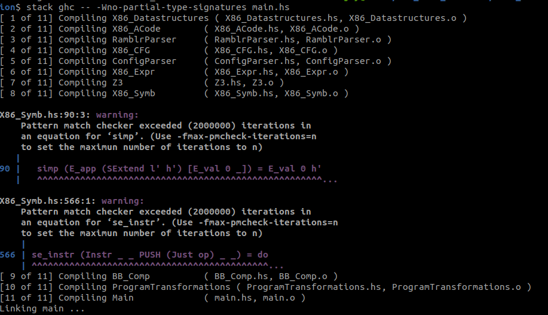

# Verification of Functional Correctness of Code Diversification Techniques

This is a tool that can be used to verify the functional equivalence between the vanilla and the diversified binaries

## Requirements
The tool is tested on Ubuntu 16.04


## Installation
Pre-requisites:
- ```sudo apt-get install build-essential, python```
- ```git checkout usenix_artifacts```

1) Haskell

- ```curl -sSL https://get.haskellstack.org/ | sh```
- ```stack ghci```

2) Z3 (Warning: You **must** download the source code and install from there *before* running the Haskell library script)

- ```wget https://github.com/Z3Prover/z3/archive/z3-4.6.0.tar.gz```
- ```tar -xvf z3-4.6.0.tar.gz```
- ```cd z3-4.6.0```
- ```python scripts/mk_make.py```
- ```cd build```
- ```make -jN```
- ```sudo make install```
After successfully installing this two software, change into the ```code abstraction``` directory and find the script named ```stack.yaml```. This is the script file which will be used to automatically install all of the necessary Haskell library files.

- ```cd code_abstraction ```
- ```stack build``` -- this will execute the script to build Haskell library and may take a long time --

Upon script is successfully finished (if it states "while building package code-abstraction-0.5.0.0 using ...", this indicates success) you may now compile the source codes using this command:

- ```stack ghc -- -Wno-warn-partial-type-signatures main.hs```

Which will generate the ```main``` executable.

It should look something like this:



## Usage

- ```cd code_abstraction```
- ```bash exec.bash```

This will execute the bash script which will provide the user with a menu to proceed further as shown below:


If you are interested in counterexample test cases, please type in "micro" from the exec.bash menu. 

Each microbenchmark has README.md file which contains more detail of the application.

# Angr

Angr is a framework that we use to disassemble binary

## Requirements
-```sudo apt-get install python3-dev libffi-dev build-essential virtualenvwrapper git```

## Installation:
-```   git clone https://github.com/angr/angr-dev```

-```  cd angr-dev```

-```  ./setup.sh -i -e angr```

## Usage
This will create a new virtual environment that can be accessed via the command:

-```   workon angr```

After working on angr, highly recommend referring to "requirement.txt" and use it to install the necessary pip packages:

-```        pip install -r requirements.txt```

        if you have an error (such as no fidget, then search angr github for the tool, and install it using pip)
-```	           https://github.com/angr/fidget```

